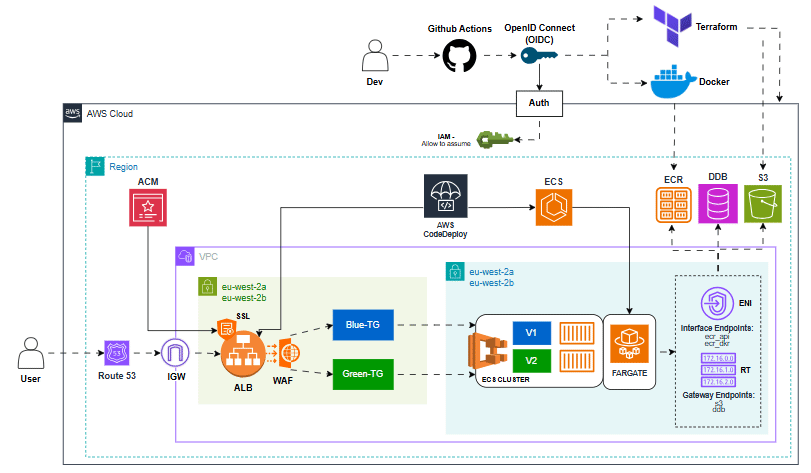

# 🚀 URL Shortener – Production-Ready ECS Deployment

## Project Overview
This project deploys a **URL Shortener service** onto AWS **ECS Fargate** with infrastructure managed through **Terraform** and deployments automated by **GitHub Actions**. The solution provisions a secure and scalable environment, including private VPC networking, an Application Load Balancer with HTTPS (ACM), Route 53 DNS integration, DynamoDB for URL persistence, and AWS WAF for threat protection. 

Application images are built, vulnerability-scanned, and pushed to Amazon ECR, then rolled out using **blue/green canary** deployments with automatic rollback via **CodeDeploy**. With this setup, infrastructure and application updates are consistent, secure, and fully automated, delivering a resilient URL shortener accessible via a custom domain over HTTPS.

The service takes a long URL and returns a shorter, unique code. Users can then access the short link and be redirected to the original URL. For example:

```bash
POST /shorten  { "url": "https://example.com/my/very/long/path" }
→ { "short": "abc123ef", "url": "https://example.com/my/very/long/path" }

GET /abc123ef
→ HTTP 302 redirect to https://example.com/my/very/long/path
```


## 🏗️ Architecture Diagram:

<p align="center">
  
</p>

## 📁 Project Structure
```
└── ECS-URL-SHORTENER
    ├── pre-commit-config.yaml
    ├── app/
    ├── terraform/
    │    ├── backend.tf
    │    ├── main.tf
    │    ├── provider.tf
    │    ├── variables.tf
    │    └── modules/
    │        ├── ACM/
    │        ├── ALB/
    │        ├── CodeDeploy/
    │        ├── ECS/
    │        ├── IdP/
    │        ├── Route53/
    │        └── VPC/
    └── .github/workflows/
           ├── codedeploy-deploy.yaml
           ├── docker-build-push-register.yaml
           ├── tf-apply-destroy.yaml
           └── tf-lint-scan-plan.yaml
```

## 🏗️ Architecture
#### Key Components:

- **ECS Fargate**: Runs Python app containers inside private subnets for secure, scalable compute.
- **AWS WAF**: Protects against malicious input using AWS Managed Rules.
- **CodeDeploy**: Enables blue/green deployments with automatic rollback on health check failures.
- **GitHub Actions + OIDC**: Implements secure CI/CD pipelines without long-lived AWS credentials.
- **VPC Endpoints**: Provides private access to AWS services, avoiding NAT gateway costs.
- **DynamoDB**: Stores short-to-long URL mappings with pay-per-request billing and point-in-time recovery (PITR).
- **Application Load Balancer (ALB)**: Handles HTTPS termination, routing, and health checks.
- **ACM + Route 53**: Issues TLS certificates and maps a custom domain
- **Code & Container Security**:
    - **Pre-Commit Hooks & Linting →** Terraform code is automatically formatted and validated before any commit, catching syntax errors and misconfigurations early
    - **Checkov →** Scans Terraform infrastructure for policy violations and security misconfigurations, ensuring compliance before deployment
    - **Trivy →** Scans container images for critical and high-severity vulnerabilities before they are pushed to ECR, preventing insecure images from reaching production