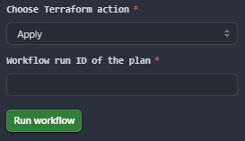

# 🚀 URL Shortener – Production-Ready ECS Deployment

## Project Overview
This project deploys a **URL Shortener service** onto AWS **ECS Fargate** with infrastructure managed through **Terraform** and deployments automated by **GitHub Actions**. The solution provisions a secure and scalable environment, including private VPC networking, an Application Load Balancer with HTTPS (ACM), Route 53 DNS integration, DynamoDB for URL persistence, and AWS WAF for threat protection. 

Application images are built, vulnerability-scanned, and pushed to Amazon ECR, then rolled out using **blue/green canary** deployments with automatic rollback via **CodeDeploy**. With this setup, infrastructure and application updates are consistent, secure, and fully automated, delivering a resilient URL shortener accessible via a custom domain over HTTPS.

The service takes a long URL and returns a shorter, unique code. Users can then access the short link and be redirected to the original URL. For example:

```bash
POST /shorten  { "url": "https://example.com/my/very/long/path" }
→ { "short": "abc123ef", "url": "https://example.com/my/very/long/path" }

GET /abc123ef
→ HTTP 302 redirect to https://example.com/my/very/long/path
```


## 🏗️ Architecture Diagram:

<p align="center">
  
</p>

## 📁 Project Structure
```
└── ECS-URL-SHORTENER
    ├── pre-commit-config.yaml
    ├── app/
    ├── terraform/
    │    ├── backend.tf
    │    ├── main.tf
    │    ├── provider.tf
    │    ├── variables.tf
    │    └── modules/
    │        ├── ACM/
    │        ├── ALB/
    │        ├── CodeDeploy/
    │        ├── ECS/
    │        ├── IdP/
    │        ├── Route53/
    │        └── VPC/
    └── .github/workflows/
           ├── codedeploy-deploy.yaml
           ├── docker-build-push-register.yaml
           ├── tf-apply-destroy.yaml
           └── tf-lint-scan-plan.yaml
```

## 🏗️ Architecture
#### Key Components:

- **ECS Fargate**: Runs Python app containers inside private subnets for secure, scalable compute.
- **AWS WAF**: Protects against malicious input using AWS Managed Rules.
- **CodeDeploy**: Enables blue/green deployments with automatic rollback on health check failures.
- **GitHub Actions + OIDC**: Implements secure CI/CD pipelines without long-lived AWS credentials.
- **VPC Endpoints**: Provides private access to AWS services, avoiding NAT gateway costs.
- **DynamoDB**: Stores short-to-long URL mappings with pay-per-request billing and point-in-time recovery (PITR).
- **Application Load Balancer (ALB)**: Handles HTTPS termination, routing, and health checks.
- **ACM + Route 53**: Issues TLS certificates and maps a custom domain
- **Code & Container Security**:
    - **Pre-Commit Hooks & Linting →** Terraform code is automatically formatted and validated before any commit, catching syntax errors and misconfigurations early
    - **Checkov →** Scans Terraform infrastructure for policy violations and security misconfigurations, ensuring compliance before deployment
    - **Trivy →** Scans container images for critical and high-severity vulnerabilities before they are pushed to ECR, preventing insecure images from reaching production

#
## ⚙️ How It Works
### 🐳 Docker Build, Push & Task Definition Registration
The URL Shortener container is built from the `app/` directory and deployed via the GitHub Actions workflow `docker-build-push-register.yaml`. This workflow ensures the container image is tested, secure, and immediately integrated into ECS for deployment.
- Authenticates to Amazon ECR using GitHub OIDC **(no long-lived keys)**.
- Builds the Docker image and tags it with the Git SHA for traceability.
- Scans the image for critical/high vulnerabilities using Trivy, publishing results to GitHub’s Security tab.
- Pushes the image to Amazon ECR for ECS Fargate consumption.
- Fetches the latest ECS task definition, replaces the container image with the new tag, and registers a new task definition revision.
```yaml
- name: Build the image
  run: |
    primary_tag="$REGISTRY/$REPOSITORY:$sha"
    docker build -t $primary_tag ./app
    
- name: Run Trivy vulnerability scanner
  uses: aquasecurity/trivy-action@0.28.0
```
> 🛠️ Builds the Docker image and runs a Trivy scan to catch critical/high vulnerabilities before pushing.
```yaml
- name: Replace image in task definition
  run: |
    jq --arg img "${{ steps.build.outputs.primary_tag }}" \
    '.containerDefinitions[0].image = $img' old-task-def.json > new-task-def.json

- name: Register new ECS task definition revision
  run: |
    ARN=$(aws ecs register-task-definition \
    --cli-input-json file://new-task-def.json
```
> 📦 Updates the ECS task definition with the new image and registers a fresh revision, making it ready for deployment.

#
### 🌐 Terraform Infrastructure Provisioning
All infrastructure is defined in the `terraform/` directory with a modular setup (VPC, ALB, ECS, ACM, Route 53, DynamoDB, WAF). This modular approach makes the code easy to extend, test, and maintain.
- Provisions a dedicated VPC with private/public subnets and VPC Endpoints **(avoids NAT Gateway cost)**.
- Creates an Application Load Balancer (ALB) with ACM-managed TLS certificates and Route 53 DNS integration.
- Attaches **AWS WAF** with managed rule sets for threat protection.
- Deploys the ECS Fargate service, pulling the latest container image from Amazon ECR.
- Configures **DynamoDB** for persistent short-to-long URL mapping (pay-per-request, PITR enabled).

```yaml
module "ECS" {
  source                  = "./modules/ECS"
  vpc_id                  = module.VPC.vpc_id
  private_subnets         = module.VPC.private_subnets
  ddb_table_name          = var.ddb_table_name
  target_group_arn        = module.ALB.target_group_blue_arn
  container_name          = "url-shortener"
  container_port          = "8080"
  ...
}
```
> 🏗️ One `terraform apply` provisions the entire stack - networking, security, compute, DNS, and database in a fully automated way.

#
### 🔍 Terraform Plan, Security & Deployment
Before applying any changes, the Terraform workflows validate, scan, and manage infrastructure updates, ensuring safe, compliant deployments. The workflows are required to prevent unverified or incorrect plans from being applied, acting as a critical safety gate to the AWS environment.

**Plan & Security Scanning:**
- Runs `terraform init` and `terraform plan` to preview infrastructure changes without applying them.
- Executes **TFLint** to detect syntax errors, unused variables, and configuration issues.
- Uses **Checkov** to scan Terraform code for security misconfigurations (e.g., unencrypted storage, overly permissive IAM roles).
- Uploads SARIF reports to **GitHub’s Security** tab for visibility and auditing.

```yaml
- name: Run TFLint
  run: |
    tflint --init
    tflint --format sarif > tflint.sarif

- name: Run Checkov
  uses: bridgecrewio/checkov-action@v12
```

**Apply & Destroy:**
 - **Terraform apply** - Safely provisions or updates the complete AWS infrastructure stack, ensuring all resources are deployed consistently and securely. This step only runs after the plan has been validated.
 - **Terraform destroy** - Tears down environments when no longer needed, helping avoid unnecessary AWS costs in dev/test setups.

 <p align="center">
   
 </p>

  > 📌 Key Benefit: The workflow enforces that only validated plans reach production, reducing human error and preventing misconfigured or unsafe infrastructure from being deployed.